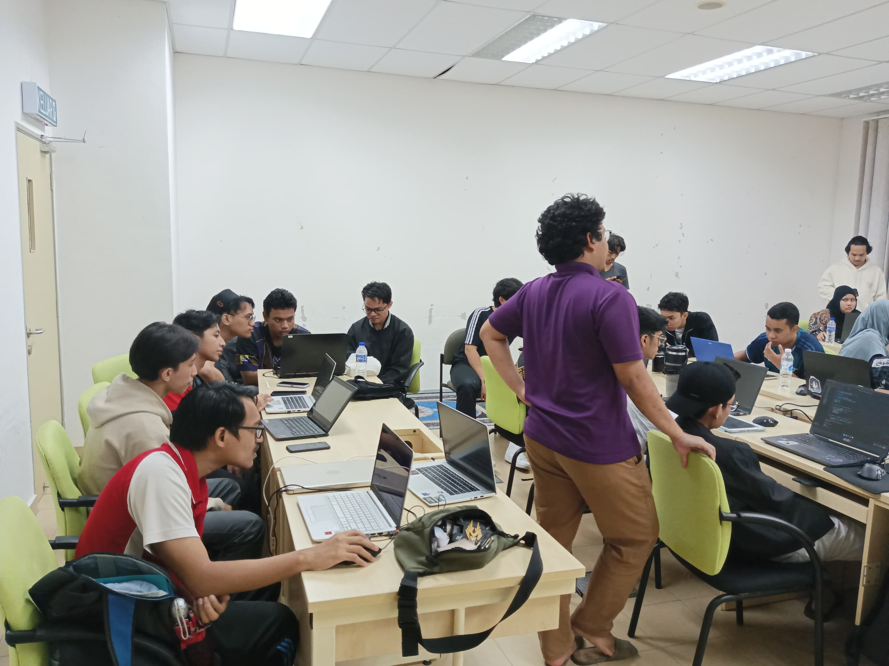

# Explain What is Authentication

Authentication is the process of verifying the identity of a user or system. It answers the question: "Who are you?". This is a critical step to ensure that only authorized users can access resources, systems, or applications. Common authentication methods include:

- **Username and Password**: The most traditional method where users provide a unique identifier and a secret password.
- **Multi-Factor Authentication (MFA)**: Adds an extra layer of security by requiring additional factors such as OTPs or biometric data.
- **Token-Based Authentication**: Uses tokens like JWT (JSON Web Tokens) that are issued upon successful login to authenticate further requests.
- **OAuth**: Commonly used for delegating access between services (e.g., "Log in with Google").

    <h2>CodeDojo-Session-2-Authentication-And-Authorization</h2>
    

# Authentication Experiment (Using Dev Tools)

## Log in to the Application
1. Perform the login process to authenticate yourself.

## Open Dev Tools and Inspect Cookies
1. Open your browser's developer tools (usually by pressing `F12` or `Ctrl+Shift+I`).
2. Navigate to the **Application** tab and select the **Cookies** section.
3. Look for cookies related to the application, which might include:
   - **Session Cookies**: Temporary cookies that expire once you close the browser.
   - **Persistent Cookies**: Stored cookies that survive browser restarts.

## Delete the Cookie
1. Select and delete the authentication-related cookie(s).
   - Cookies are often used to maintain a logged-in state (e.g., a session ID or token).

## Refresh the Page
1. Notice that deleting the cookie invalidates your session, and you are likely logged out or denied access.
   - This demonstrates how cookies play a role in maintaining authentication state.

<!DOCTYPE html>
<html lang="en">
<head>
    <meta charset="UTF-8">
    <meta name="viewport" content="width=device-width, initial-scale=1.0">
    
</head>
<body>
    <h1>In Memories</h1>
    

        
        
        
    

</body>
</html>